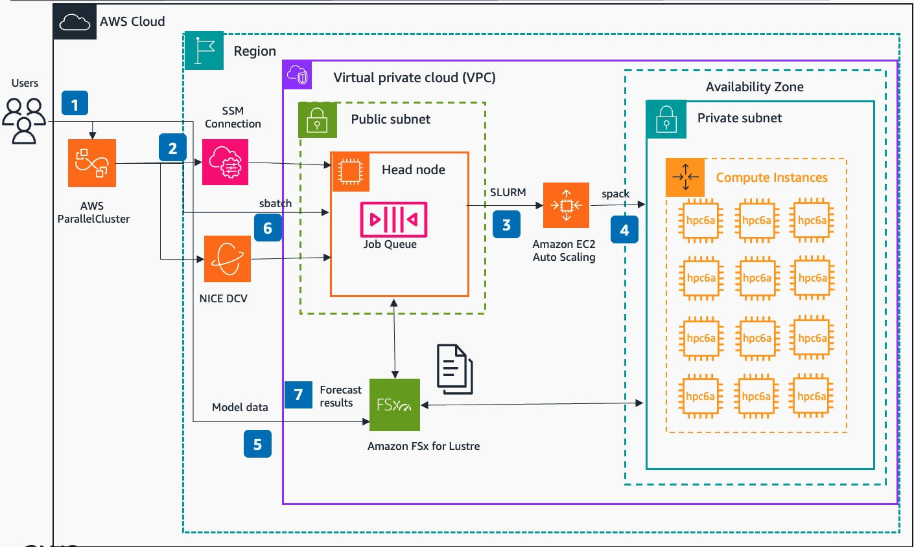

#  Guidance for HPC Numerical Weather Prediction (NWP) on AWS

## Overview

Amazon Web Services (AWS) provides the most elastic and scalable cloud infrastructure to run your weather workloads. With virtually unlimited capacity, engineers, researchers, HPC system administrators, and organizations can innovate beyond the limitations of on-premises HPC infrastructure.

HPC on AWS removes the long wait times and lost productivity often associated with on-premises HPC clusters. Flexible HPC cluster configurations and virtually unlimited scalability allows you to grow and shrink your infrastructure as your workloads dictate, not the other way around. Additionally, with access to a broad portfolio of cloud-based services for Data Analytics, Artificial Intelligence (AI), and Machine Learning (ML), you can reinvent traditional NWP workflows to derive results faster and under budget.

Find our Weather HPC customer case studies at https://aws.amazon.com/hpc/customers/, under **Weather**.

This guidance is designed for builders who want to learn more about running weather codes within AWS.

## Architecture Overview

### Architecture diagram
Architecture diagram below shows a sample HPC Cluster Architecture and user interaction with itvia ParallelCluster UI  in order to run numerical weather prediction tasks

 
Sample HPC Cluster Architecture and User interactions for Numerical Weather prediction on AWS

### Architecture steps
Below are the steps of User interactiions with AWS ParallelCluster UI in order to configure HPC cluster with compute and storage capabilities, configure and run weather prediction model.

- Users authenticate to AWS ParallelCluster UI via Amazon Cognito, API Gateway and Lambda
- Users connect to HPC Cluster via AWS ParallelCluster UI using SSM Connection or DCV
- SLURM (one of HPC resource managers from SchedMD ) is used to manage resources of AWS ParallelCluster using Amazon EC2 Auto scaling
- Spack is a package manager for supercomputers, Linux, and macOS. It is used to install necessary compilers, libraries including NCAR Command Language (NCL) and Weather Research & Forecasting Model (WRF) model
- Amazon FSx for Lustre storage created along with HPC cluster. Input data used for simulating WRF test model - 12-km CONUS (Continental United States) – is copied to /fsx directory mapped to that storage
- Users create sbatch script to run the CONUS 12-km model, submit that job and monitor its status via squeue
- Weather Forecast results are stored locally in /fsx/conus_12km/ and can be visualized using NCL scripts

## AWS services in this Guidance

The following AWS Services are deployed in this Guidance:

- [Amazon VPC](https://aws.amazon.com/vpc/)
- [Amazon EC2](https://aws.amazon.com/ec2/)
- [Amazon API Gateway](https://aws.amazon.com/api-gateway/)
- [Amazon Cognito](https://aws.amazon.com/cognito/)
- [Amazon Lambda](https://aws.amazon.com/lambda/)
- [Amazon FSx for Lustre](https://aws.amazon.com/fsx/lustre/)
- [AWS Parallel Cluster](https://aws.amazon.com/hpc/parallelcluster/)

## Plan your deployment

## Security
When you build systems on AWS infrastructure, security responsibilities are shared between you and AWS. This [shared responsibility model](https://aws.amazon.com/compliance/shared-responsibility-model/) reduces your operational burden because AWS operates, manages, and controls the components including the host operating system, the virtualization layer, and the physical security of the facilities in which the services operate. For more information about AWS security, visit [AWS Cloud Security](http://aws.amazon.com/security/).
[AWS ParallelCluster](https://aws.amazon.com/hpc/parallelcluster/)  users are securely authenticiated and authorized to their roles via [Amazon Cognito](https://aws.amazon.com/cognito/) user pool service integrated with [Amazon API](https://aws.amazon.com/api-gateway/) and [Lambda](https://aws.amazon.com/lambda) services. 
 
HPC cluster EC2 components are deployed into a [Virtual Private Cloud](https://aws.amazon.com/vpc/) (VPC) which provides additional network security isolation for all contained components. Head Node is depoyed into a Public subnet and available for access via secure connections (SSH and DCV), compute nodes are deployed into Private subnets and managed from Head node via SLURM package manager. Data stored in Amazon FSx for Lustre is [enrypted at rest and in transit](https://docs.aws.amazon.com/fsx/latest/LustreGuide/encryption-fsxl.html)

See [CONTRIBUTING](CONTRIBUTING.md#security-issue-notifications) for more information.

## License

This library is licensed under the MIT-0 License. See the LICENSE file.

