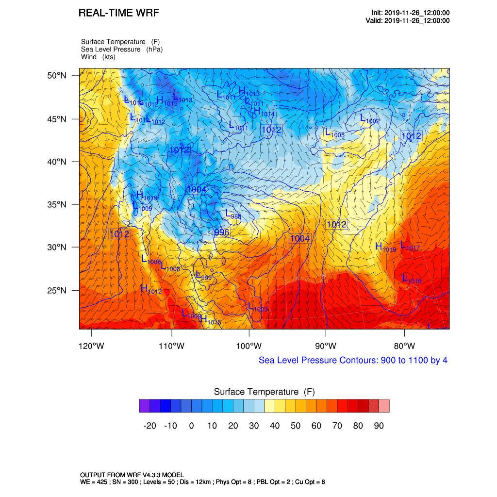
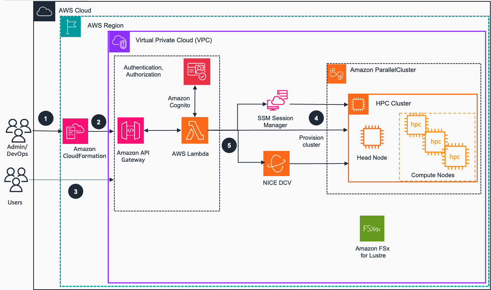
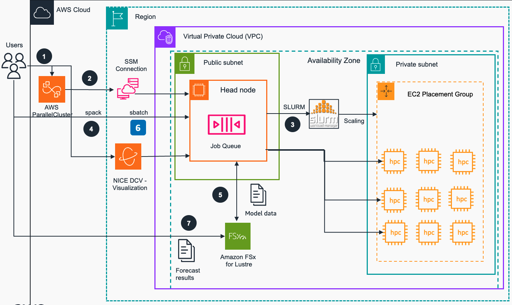

#  Guidance for Building a High-Performance Numerical Weather Prediction System on AWS

## Overview

Amazon Web Services (AWS) provides the most elastic and scalable cloud infrastructure to run your weather workloads. With virtually unlimited capacity, engineers, researchers, HPC system administrators, and organizations can innovate beyond the limitations of on-premises HPC infrastructure.

High Performance Compute (HPC) on AWS removes the long wait times and lost productivity often associated with on-premises HPC clusters. Flexible HPC cluster configurations and virtually unlimited scalability allows you to grow and shrink your infrastructure as your workloads dictate, not the other way around. Additionally, with access to a broad portfolio of cloud-based services for Data Analytics, Artificial Intelligence (AI), and Machine Learning (ML), you can reinvent traditional NWP workflows to derive results faster and under budget.

Find our Weather HPC customer case studies at: https://aws.amazon.com/hpc/customers/, under **Weather**.

This guidance is intended for builders who want to learn hands-on about running weather codes on AWS.

 
Figure 1. Sample Surface temperature model obtained by Numerical Weather prediction

## Architecture Overview

### Architecture diagrams
Architecture diagrams below shows a sample HPC Cluster architecture, provisoning process and user interactionsvia ParallelCluster UI  in order to run numerical weather forecasting tasks
 

 
Figure 2: AWS ParallelCluster UI and HPC Cluster Architecture
 
Below are steps that provision AWS ParallelCluster UI and configure HPC cluster with compute and storage capabilities:

1. Users  deploy guidance [Amazon CloudFormation](https://aws.amazon.com/cloudformation/)  stack that provisions networking resources ([Amazon VPC](https://aws.amazon.com/vpc/), subnets), [Amazon API Gateway](https://aws.amazon.com/api-gateway/), storage ([Amazon FSx for Lustre](https://aws.amazon.com/fsx/lustre/)) and finally [Amazon ParallelCluster UI](https://docs.aws.amazon.com/parallelcluster/) .
2. Amazon ParallelCluster UI endpoint is available for Users authentication  via [Amazon API Gateway](https://aws.amazon.com/api-gateway/) 
3. Users authenticate to AWS ParallelCluster UI endpoint via integrated triggering triggering [AWS Lambda](https://aws.amazon.com/lambda/)) function and handling login details via [Amazon Cognito](https://aws.amazon.com/cognito/).
4. Authenticated Users provision [HPC clusters](https://aws.amazon.com/hpc/) via ParallelCluster UI using sample cluster specifications available with guidance code. Each HPC cluster has a Head node and Compute node(s) getting dynamically provisioned for application workload execution.
5. Users authenticated via ParallelCluster UI can connect to HPC cluster using [AWS SSM Session Manager](https://docs.aws.amazon.com/systems-manager/latest/userguide/session-manager.html) or via [NICE DCV](https://www.ni-sp.com/products/nice-dcv/) sessions

 

 
Figure 3. HPC Cluster Architecture and User interactions for running Numerical Weather prediction on AWS
 
Below are the steps of User interactions with AWS ParallelCluster UI in order to configure HPC cluster with compute and storage capabilities, then deploy and run Numerical Weather prediction model.

1. User authenticates to [AWS ParallelCluster UI](https://aws.amazon.com/hpc/parallelcluster/) via [Amazon Cognito](https://aws.amazon.com/cognito/), [API Gateway](https://aws.amazon.com/api-gateway/) and [Lambda](https://aws.amazon.com/lambda/)
2. User connects to HPC Cluster via AWS ParallelCluster UI using SSM Connection or [NICE DCV](https://docs.aws.amazon.com/dcv/latest/adminguide/what-is-dcv.html) (latter can be used directly w/o ParallelCluster UI)
3. [SLURM ](https://slurm.schedmd.com/) (HPC resource manager from SchedMD) is installed and used to manage resources of AWS ParallelCluster driving resource scaling.
4. [Spack](https://spack.io/) is a Package manager for supercomputers, Linux, and macOS. It is used to install necessary compilers and libraries, including NCAR Command Language (NCL) and [Weather Research & Forecasting Model (WRF) model](https://ncar.ucar.edu/what-we-offer/models/weather-research-and-forecasting-model-wrf)
5. [Amazon FSx for Lustre](https://aws.amazon.com/fsx/lustre/) storage is provisioned along with other HPC cluster resources. Input data used for simulating WRF test model - 12-km CONUS (Continental United States) – is copied to `/fsx` directory mapped to that storage 
6. Users create _sbatch_ script to run the CONUS 12-km model, submit that job and monitor its status via _squeue_ command. 
7. Weather Forecast results are stored locally in the _/fsx/conus_12km/_ folder and can be visualized using NCL scripts

## AWS Services in this Guidance

The following AWS Services are deployed in this Guidance:

| **AWS service**  | Description |
|-----------|------------|
|[Amazon VPC](https://aws.amazon.com/vpc/)|Core Service - provides additional Networking isolation and security | 
|[Amazon EC2](https://aws.amazon.com/ec2/)|Core Service - EC2 instances used as cluster nodes |
|[Amazon API Gateway](https://aws.amazon.com/api-gateway/)|Core service - create, publish, maintain, monitor, and secure APIs at scale|
|[Amazon Cognito](https://aws.amazon.com/cognito/)|Core service - provides user identity and access management (IAM) services|
|[Amazon Lambda](https://aws.amazon.com/lambda/)|Core service - provides serverless automation of user authentication|
|[Amazon FSx for Lustre](https://aws.amazon.com/fsx/lustre/)|Core service - provides high-performance Lustre file system |
|[Amazon Parallel Cluster](https://aws.amazon.com/hpc/parallelcluster/)|Core service - Open source cluster management tool for deployment and management of High Performance Computing (HPC) clusters |
|[Amazon High Performance Computing HPC cluster](https://aws.amazon.com/hpc/)|Core service - high performance compute resource|
|[Amazon System Manager Session Manager](https://docs.aws.amazon.com/systems-manager/latest/userguide/session-manager.html)|Auxiliary service - instance connection management|

## Plan your deployment

### Supported AWS Regions

This Guidance uses EC2 services with [specific instances such as `hpc6`](https://aws.amazon.com/ec2/instance-types/hpc6/) and FSx for Lustre services, which may not currently be available in all AWS Regions. You must launch this solution in an AWS Region where EC2 specific instance types and Fsx is available. For the most current availability of AWS services by Region, refer to the [AWS
Regional Services
List](https://aws.amazon.com/about-aws/global-infrastructure/regional-product-services/).

**Guidance for Numerical Weather Prediction with Weather Research and Forecasting Model on AWS** is currently supported in the following AWS Regions (based on availability of [hpc6a](https://aws.amazon.com/ec2/instance-types/hpc6a/), [hpc7a](https://aws.amazon.com/ec2/instance-types/hpc7a/) and [hpc7g](https://aws.amazon.com/ec2/instance-types/hpc7g/) instances:

| AWS Region     | Amazon EC2 HPC Optimized Instance type                                                                                   |
| -------------- | ------------------------------------------------------------------------------------------------------------------------ |
| ap-southeast-1 | hpc6a.48xlarge                                                                                                           |
| eu-north-1     | hpc6id.32xlarge   hpc6a.48xlarge                                                                                      |
| eu-west-1      | hpc7a.12xlarge  hpc7a.24xlarge  hpc7a.48xlarge  hpc7a.96xlarge                                               |
| us-east-1      | hpc7g.4xlarge  hpc7g.8xlarge  hpc7g.16xlarge                                                                    |
| us-east-2      | hpc6a.48xlarge   hpc6id.32xlarge   hpc7a.12xlarge   hpc7a.24xlarge   hpc7a.48xlarge   hpc7a.96xlarge   |

## Security

When you build systems on AWS infrastructure, security responsibilities are shared between you and AWS. This [shared responsibility
model](https://aws.amazon.com/compliance/shared-responsibility-model/) reduces your operational burden because AWS operates, manages, and
controls the components including the host operating system, the virtualization layer, and the physical security of the facilities in
which the services operate. For more information about AWS security, visit [AWS Cloud Security](http://aws.amazon.com/security/).

[AWS ParallelCluster](https://aws.amazon.com/hpc/parallelcluster/) users are securely authenticiated and authorized to their roles via [Amazon Cognito](https://aws.amazon.com/cognito/) user pool service. HPC cluster EC2 components are deployed into a Virtual Private Cloud (VPC) which provides additional network security isolation for all contained components. Head Node is depoyed into a Public subnet and available for access via secure connections (SSH and DCV), compute nodes are deployed into Private subnet and managed from Head node via SLURM package manager. Data stored in Amazon FSx for Lustre is [enrypted at rest and in transit](https://docs.aws.amazon.com/fsx/latest/LustreGuide/encryption-fsxl.html).

## Deployment Steps
<!-- TO DO: update the link once is published -->

<b>Please see published [Implementation Guide](https://implementationguides.kits.eventoutfitters.aws.dev/numerical-weather-0608/compute/numerical-weather-prediction-with-forecasting-model.html) for step-by-step deployment instructions for this guidance.</b>

See [CONTRIBUTING](CONTRIBUTING.md#security-issue-notifications) for more information.

## License

This library is licensed under the MIT-0 License. See the LICENSE file.

